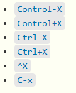
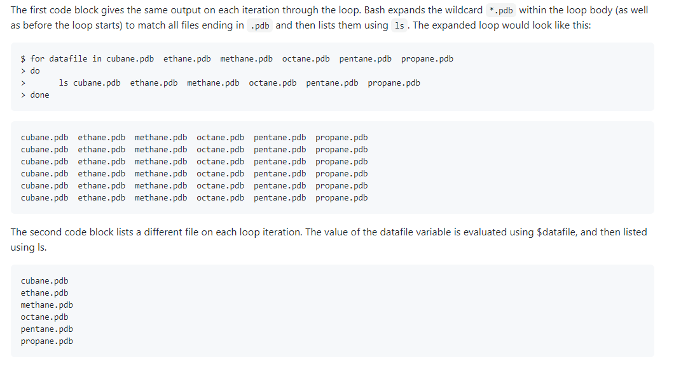
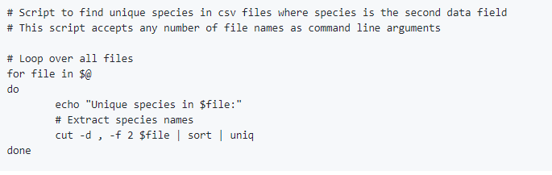
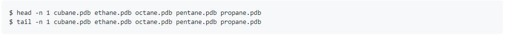
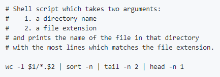
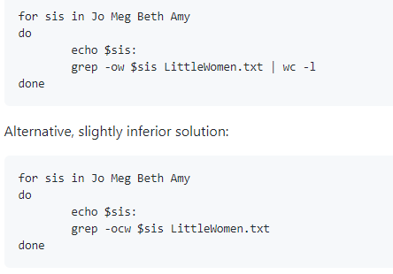
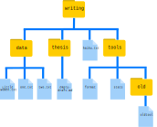

# Nelle’s Pipeline: A Typical Problem

Nelle Nemo, a marine biologist, has just returned from a six-month survey of the North Pacific Gyre, where she has been sampling gelatinous marine life in the Great Pacific Garbage Patch. She has 1520 samples that she’s run through an assay machine to measure the relative abundance of 300 proteins. She needs to run these 1520 files through an imaginary program called `goostats` she inherited. On top of this huge task, she has to write up results by the end of the month so her paper can appear in a special issue of Aquatic Goo Letters.

The bad news is that if she has to run `goostats` by hand using a GUI, she’ll have to select and open a file 1520 times. If `goostats` takes 30 seconds to run each file, the whole process will take more than 12 hours of Nelle’s attention. With the shell, Nelle can instead assign her computer this mundane task while she focuses her attention on writing her paper.

The next few lessons will explore the ways Nelle can achieve this. More specifically, they explain how she can use a command shell to run the `goostats` program, using loops to automate the repetitive steps of entering file names, so that her computer can work while she writes her paper.


# Episode 2 Navigating Files and Directories


## 2.1 Exploring More `ls` Flags

What does the command `ls` do when used
with the `-l` option? 

What about if you use both the `-l` and the `-h` option?

<details>
<summary>Solution
</summary>
`-l` - long listing format, showing not only the file/directory names but also additional information such as the file size and the time of its last modification. Some of its output is about properties that we do not cover in this lesson (such as file permissions and ownership), but the rest should be useful nevertheless.   
 
`-h` + `-l`  - makes file size ‘Human readable’, i.e. `5.3K` instead of `5369`.
</details>


## 2.2 Listing in Reverse Chronological Order
By default ls lists the contents of a directory in alphabetical order by name. The command `ls -t` lists items by time of last change instead of alphabetically. The command `ls -r` lists the contents of a directory in reverse order. What happens when you combine the `-t` and `-r` flags? Hint: You may need to use the `-l` flag to see the last changed dates.

<details>
<summary>Solution

</summary>
`-t` - most recently changed file first.    

`-rt` - most recently changed file last.  

This can be very useful for finding your most recent edits or checking to see if a new output file was written.
</details>


## 2.3 Absolute vs Relative Paths
Starting from `/Users/amanda/data`, which of the following commands could Amanda use to navigate to her home directory, which is `/Users/amanda`?

1. `cd .`
2. `cd /`
3. `cd /home/amanda`
4. `cd ../..`
5. `cd ~`
6. `cd home`
7. `cd ~/data/..`
8. `cd`
9. `cd ..`


<details>
<summary>Solution
</summary>


1. No: `.` stands for the current directory.
<br>
2. No: `/` stands for the root directory.
<br>
3. No: Amanda's home directory is `/Users/amanda`.
<br>
4. No: this goes up two levels, i.e. ends in `/Users`.
<br>
<strong>5. Yes: `~` stands for the user's home directory, in this case `/Users/amanda`.</strong>
<br>
6. No: this would navigate into a directory `home` in the current directory if it exists.
<br>
<strong>7. Yes: unnecessarily complicated, but correct.</strong>
<br>
<strong>8. Yes: shortcut to go back to the user's home directory.</strong>
<br>
<strong>9. Yes: goes up one level.</strong>
</details>

## 2.4 Relative Path Resolution
If `pwd` displays `/Users/thing`,
 what will `ls -F ../backup` display?
1.  `../backup: No such file or directory`
2.  `2012-12-01 2013-01-08 2013-01-27`
3.  `2012-12-01/ 2013-01-08/ 2013-01-27/`
4.  `original/ pnas_final/ pnas_sub/`


<details>
<summary>Solution  
</summary>
1. No: there *is* a directory `backup` in `/Users`.  
<br>
2. No: this is the content of `Users/thing/backup`, but with `..` we asked for one level further up.  
<br>
3. No: see previous explanation.  
<br>
<strong>4. Yes: `../backup/` refers to `/Users/backup/`.</strong>
</details>

## 2.5 `ls` Reading Comprehension

If `pwd` displays `/Users/backup`,
and `-r` tells `ls` to display things in reverse order,
what command(s) will result in the following output:

~~~
pnas_sub/ pnas_final/ original/
~~~


1.  `ls pwd`

2.  `ls -r -F`

3.  `ls -r -F /Users/backup`

<details>
<summary>Solution
</summary>
1. No: `pwd` is not the name of a directory.
<br>
<strong>2. Yes: `ls` without directory argument lists files and directories in the current directory.</strong>
<br>
<strong>3. Yes: uses the absolute path explicitly.</strong>
</details>

# Episode 3 Working with Files and Directories



<!--- 
## 3.1 Creating Files a Different Way

We have seen how to create text files using the `nano` editor.
Now, try the following command:

 ~~~bash
 $ touch my_file.txt
 ~~~

1.  What did the `touch` command do?
When you look at your current directory using the GUI file explorer,
 does the file show up?

2.  Use `ls -l` to inspect the files.  How large is `my_file.txt`?

3.  When might you want to create a file this way?

<details>
<summary>Solution
</summary>
1.  The `touch` command generates a new file called `my_file.txt` in
    your current directory.  You
    can observe this newly generated file by typing `ls` at the
   command line prompt.  `my_file.txt` can also be viewed in your
   GUI file explorer.

 2.  When you inspect the file with `ls -l`, note that the size of
    `my_file.txt` is 0 bytes.  In other words, it contains no data.
   If you open `my_file.txt` using your text editor it is blank.

3.  Some programs do not generate output files themselves, but
    instead require that empty files have already been generated.
    When the program is run, it searches for an existing file to
   populate with its output.  The touch command allows you to
    efficiently generate a blank text file to be used by such
    programs.
</details>
--->
## 3.2 Moving Files to a new folder

Jamie realizes that she put the files `sucrose.dat` and `maltose.dat` into the wrong folder. 
The files should have been placed in the `raw` folder. She runs these commands to explore the file system.

~~~
$ ls -F
analyzed/ raw/

$ ls -F analyzed
fructose.dat glucose.dat maltose.dat sucrose.dat

$ cd analyzed
 ~~~


Fill in the blanks to move these files to the `raw/` folder to correct her mistake

 ~~~
$ mv sucrose.dat maltose.dat ____/____
~~~

<details>
<summary>Solution
</summary>

$ mv sucrose.dat maltose.dat ../raw

</details>

## 3.3 Renaming Files
 Suppose you created a text file called `statstics.txt`

 After creating and saving this file you realize you misspelled the filename! You want to
 correct the mistake, which of the following commands could you use to do so?

 1. `cp statstics.txt statistics.txt`
 2. `mv statstics.txt statistics.txt`
 3. `mv statstics.txt .`
 4. `cp statstics.txt .`

<details>
<summary>Solution
</summary>
 1. No.  While this would create a file with the correct name, the incorrectly named file still exists in the directory
 and would need to be deleted.
 <br>
 <strong>2. Yes</strong>
 <br>
 3. No, the period(.) indicates where to move the file, but does not provide a new file name; identical file names
 cannot be created.
 <br>
 4. No, the period(.) indicates where to copy the file, but does not provide a new file name; identical file names
 cannot be created.
</details>

## 3.4 Moving and Copying

What is the output of the closing `ls` command in the sequence shown below?

 ~~~
 $ pwd
 ~~~

 ~~~
 /Users/jamie/data
 ~~~

 ~~~
 $ ls
 ~~~

 ~~~
 proteins.dat
 ~~~

 ~~~
 $ mkdir recombined
 $ mv proteins.dat recombined/
 $ cp recombined/proteins.dat ../proteins-saved.dat
 $ ls
~~~


 1.   `proteins-saved.dat recombined`
 2.   `recombined`
 3.   `proteins.dat recombined`
 4.   `proteins-saved.dat`

<details>
<summary>Solution
</summary>
 2. 
 <br>
Starting in the `/Users/jamie/data` directory
<br>
  $ mkdir recombined ----> create new folder
  <br>
  $ mv proteins.dat recombined/ -----> move proteins.dat to the new folder
  <br>
  $ cp recombined/proteins.dat ../proteins-saved.dat -----> copies this file to the parent directory of our current location
</details>

<!--- 
## 3.5 Using `rm` Safely

 What happens when we execute `rm -i thesis_backup/quotations.txt`?
 Why would we want this protection when using `rm`?

<details>
<summary>Solution
</summary>
Prompt before (every) removal. The Unix shell doesn't have a trash bin, so all the files removed will disappear forever.
</details>


## 3.6 Copy with Multiple Filenames

 For this exercise, you can test the commands in the `data-shell/data` directory.

 In the example below, what does `cp` do when given several filenames and a directory name?

 ~~~
 $ mkdir backup
 $ cp amino-acids.txt animals.txt backup/
 ~~~


 In the example below, what does `cp` do when given three or more file names?

 ~~~
 $ ls -F
 ~~~

 ~~~
 amino-acids.txt  animals.txt  backup/  elements/  morse.txt  pdb/  planets.txt  salmon.txt  sunspot.txt
 ~~~

 ~~~
 $ cp amino-acids.txt animals.txt morse.txt
 ~~~


<details>
<summary>Solution
</summary>
 If given more than one file name followed by a directory name (i.e. the destination directory must
 be the last argument), `cp` copies the files to the named directory.

 If given three file names, `cp` throws an error, because it is expecting a directory
 name as the last argument.
</details>
--->
## Wildcards
(Examples from `data-shell/molecules` directory)<br><br>

**`*` matches zero or more characters.**
 
`*.pdb` matches `ethane.pdb`, `propane.pdb`, and every file that ends with `.pdb`. 
 
`p*.pdb` only matches `pentane.pdb` and `propane.pdb`

<br><br>
**`?` matches exactly one character.** 

`?ethane.pdb` would match `methane.pdb`

`*ethane.pdb` matches both `ethane.pdb`, and `methane.pdb`.

`???ane.pdb` matches three characters followed by `ane.pdb`, giving `cubane.pdb` `ethane.pdb` `octane.pdb`.


## 3.7 List filenames matching a pattern
In the `molecules` directory which `ls` command(s) will
 produce this output?

 `ethane.pdb   methane.pdb`

 1. `ls *t*ane.pdb`
 2. `ls *t?ne.*`
 3. `ls *t??ne.pdb`
 4. `ls ethane.*`

<details>
<summary>Solution
</summary>
  3.
</details>


## 3.8 Organizing Directories and Files
 Jamie is working on a project and she sees that her files aren't very well
 organized:

 ~~~
$ ls -F
 ~~~

~~~
 analyzed/  fructose.dat    raw/   sucrose.dat
 ~~~


 The `fructose.dat` and `sucrose.dat` files contain output from her data
 analysis. How could you use wildcards with the `mv` command to move both files to the `analyzed` directory at the same time?

<details>
<summary>Solution
</summary>
 mv *.dat analyzed
 </details>
 
<!---
## 3.9 Reproduce a folder structure

 You're starting a new experiment, and would like to duplicate the directory
 structure from your previous experiment so you can add new data.

 Assume that the previous experiment is in a folder called '2016-05-18',
 which contains a `data` folder that in turn contains folders named `raw` and
 `processed` that contain data files.  The goal is to copy the folder structure
 of the `2016-05-18-data` folder into a folder called `2016-05-20`
 so that your final directory structure looks like this:

	2016-05-20/
	└── data
	    ├── processed
	    └── raw

 Which of the following set of commands would achieve this objective?
 What would the other commands do?

 ~~~
 $ mkdir 2016-05-20
 $ mkdir 2016-05-20/data
 $ mkdir 2016-05-20/data/processed
 $ mkdir 2016-05-20/data/raw
 ~~~

 ~~~
 $ mkdir 2016-05-20
 $ cd 2016-05-20
 $ mkdir data
 $ cd data
 $ mkdir raw processed
 ~~~

 ~~~
 $ mkdir 2016-05-20/data/raw
 $ mkdir 2016-05-20/data/processed
 ~~~

 ~~~
 $ mkdir -p 2016-05-20/data/raw
 $ mkdir -p 2016-05-20/data/processed
 ~~~

 ~~~
 $ mkdir 2016-05-20
 $ cd 2016-05-20
 $ mkdir data
 $ mkdir raw processed
 ~~~


<details>
<summary>Solution
</summary>
 The first two sets of commands achieve this objective.
 The first set uses relative paths to create the top level directory before
 the subdirectories.

 The third set of commands will give an error because the default behavior of `mkdir` won't create a subdirectory
 of a non-existant directory: the intermediate level folders must be created first.

 The fourth set of commands achieve this objective. Remember, the `-p` option, followed by a path of one or more 
 directories, will cause `mkdir` to create any intermediate subdirectories as required.

 The final set of commands generates the 'raw' and 'processed' directories at the same level
 as the 'data' directory.
</details>
--->

# Episode 4 Pipes and Filters

## Exercise 4.1 Sorting
If we run `sort` on a file containing the following lines:

`10`   
`2`   
`19`   
`22`   
`6`   
the output is:   
`10`   
`19`  
`2`  
`22`   
`6`   

If we run `sort -n` on the same input, we get this instead:   
`2`   
`6`   
`10`   
`19`   
`22` 
  
Why?

## Exercise 4.2
The `head` command prints lines from the start of a file and the `tail` prints lines from the end of a file instead.

If we were to run these 2 commands:
```.env
$ head -n 3 animals.txt > animals-subset.txt
$ tail -n 2 animals.txt >> animals-subset.txt
```
what would `animals.txt` contain?
1. The first three lines of `animals.txt ` 
2. The last two lines of `animals.txt`  
3. The first three lines and the last two lines of `animals.txt`   
4. The second and third lines of `animals.txt` `  

<details>
<summary>Solution
</summary>
3.
</details>
<br>
<br>

##


## Exercise 4.3
In our current directory, we want to find the 3 files which have the least number of lines. Which command would work?

1. `wc -l * > sort -n > head -n 3   `
2. `wc -l * | sort -n | head -n 1-3 `  
3. `wc -l * | head -n 3 | sort -n ` 
4. `wc -l * | sort -n | head -n 3 `  

<details>
<summary>Solution
</summary>
4.        
The pipe character | is used to connect the output from one command to the input of another. > is used to redirect standard output to a file
</details>


## Exercise 4.4
A file called animals.txt looks like this:
```
2012-11-05,deer
2012-11-05,rabbit
2012-11-05,raccoon
2012-11-06,rabbit
2012-11-06,deer
2012-11-06,fox
2012-11-07,rabbit
2012-11-07,bear
```
If we run this command, what lines will end up in `final.txt`?
```
$ cat animals.txt | head -n 5 | tail -n 3 | sort -r > final.txt
```
<details>
<summary>Solution
</summary>
2012-11-06,rabbit
<br>
2012-11-06,deer
<br>
2012-11-05,raccoon

</details>


# Episode 5 Loops

The general form of a loop:

~~~
for thing in list_of_things
do
    operation_using $thing    # Indentation within the loop is not required, but aids legibility
done
~~~

## 5.1 Variables in Loops

This exercise refers to the `data-shell/molecules` directory. `ls` gives the following output:

~~~
cubane.pdb  ethane.pdb  methane.pdb  octane.pdb  pentane.pdb  propane.pdb
~~~

What is the output of the following code?

~~~
$ for datafile in *.pdb
> do
>    ls *.pdb
> done
~~~

Now, what is the output of the following code?

~~~
$ for datafile in *.pdb
> do
>	ls $datafile
> done
~~~

Why do these two loops give different outputs?

<details>
<summary>Solution</summary>



</details>

## 5.2.1 Limiting Sets of Files

What would be the output of running the following loop in the `data-shell/molecules` directory?

~~~
$ for filename in c*
> do
>    ls $filename
> done
~~~

1. No files are listed.
2. All files are listed.
3. Only `cubane.pdb`, `octane.pdb` and `pentane.pdb` are listed.
4. Only `cubane.pdb` is listed.

<details>
<summary>Solution</summary>

<strong>4 is the correct answer.</strong> `*` matches zero or more characters, so any file name starting with the letter c, followed by zero or more other characters will be matched.

</details>

## 5.2.2 Limiting Sets of Files (Part 2)

How would the output differ from using this command instead?

~~~
$ for filename in *c*
> do
>    ls $filename
> done
~~~

1. The same files would be listed.
2. All the files are listed this time.
3. No files are listed this time.
4. The files cubane.pdb and octane.pdb will be listed.
5. Only the file octane.pdb will be listed.

<details>
<summary>Solution</summary>

<strong>4 is the correct answer.</strong> `*` matches zero or more characters, so a file name with zero or more characters before a letter c and zero or more characters after the letter c will be matched.

</details>

## 5.3 Saving to a File in a Loop - Part One

In the `data-shell/molecules` directory, what is the effect of this loop?

~~~
for alkanes in *.pdb
do
    echo $alkanes
    cat $alkanes > alkanes.pdb
done
~~~

1. Prints `cubane.pdb`, `ethane.pdb`, `methane.pdb`, `octane.pdb`, `pentane.pdb` and `propane.pdb`, and the text from `propane.pdb` will be saved to a file called `alkanes.pdb`.
2. Prints `cubane.pdb`, `ethane.pdb`, and `methane.pdb`, and the text from all three files would be concatenated and saved to a file called `alkanes.pdb`.
3. Prints `cubane.pdb`, `ethane.pdb`, `methane.pdb`, `octane.pdb`, and `pentane.pdb`, and the text from `propane.pdb` will be saved to a file called `alkanes.pdb`.
4. None of the above.

<details>
<summary>Solution</summary>

<strong>1 is the correct answer.</strong> The text from each file in turn gets written to the `alkanes.pdb` file. However, the file gets overwritten on each loop interaction, so the final content of `alkanes.pdb` is the text from the `propane.pdb` file.

</details>

## 5.4 Saving to a File in a Loop - Part Two

Also in the `data-shell/molecules` directory, what would be the output of the following loop?

~~~
for datafile in *.pdb
do
    cat $datafile >> all.pdb
done
~~~

1. All of the text from `cubane.pdb`, `ethane.pdb`, `methane.pdb`, `octane.pdb`, and `pentane.pdb` would be concatenated and saved to a file called `all.pdb`.
2. The text from `ethane.pdb` will be saved to a file called `all.pdb`.
3. All of the text from `cubane.pdb`, `ethane.pdb`, `methane.pdb`, `octane.pdb`, `pentane.pdb` and `propane.pdb` would be concatenated and saved to a file called `all.pdb`.
4. All of the text from `cubane.pdb`, `ethane.pdb`, `methane.pdb`, `octane.pdb`, `pentane.pdb` and `propane.pdb` would be printed to the screen and saved to a file called `all.pdb`.

<details>
<summary>Solution</summary>

<strong>3 is the correct answer.</strong> `>>` appends to a file, rather than overwriting it with the redirected output from a command. Given the output from the `cat` command has been redirected, nothing is printed to the screen.

</details>

<br>
<br>
<br>


<br>
<br>
<br>
## 5.5 Doing a Dry Run

A loop is a way to do many things at once — or to make many mistakes at once if it does the wrong thing. One way to check what a loop would do is to `echo` the commands it would run instead of actually running them.

Suppose we want to preview the commands the following loop will execute without actually running those commands:

~~~
$ for datafile in *.pdb
> do
>   cat $datafile >> all.pdb
> done
~~~

What is the difference between the two loops below, and which one would we want to run?

~~~
# Version 1
$ for datafile in *.pdb
> do
>   echo cat $datafile >> all.pdb
> done
~~~

~~~
# Version 2
$ for datafile in *.pdb
> do
>   echo "cat $datafile >> all.pdb"
> done
~~~

<details>
<summary>Solution</summary>

<strong>The second version is the one we want to run.</strong> This prints to screen everything enclosed in the quote marks, expanding the loop variable name because we have prefixed it with a dollar sign.
<br><br>
The first version appends the output from the command `echo cat $datafile` to the file, `all.pdb`. This file will just contain the list; `cat cubane.pdb`, `cat ethane.pdb`, `cat methane.pdb` etc.
<br>
Try both versions for yourself to see the output! Be sure to open the `all.pdb` file to view its contents.

</details>

## 5.6 Nested Loops

Suppose we want to set up a directory structure to organize some experiments measuring reaction rate constants with different compounds and different temperatures. What would be the result of the following code:

~~~
$ for species in cubane ethane methane
> do
>     for temperature in 25 30 37 40
>     do
>         mkdir $species-$temperature
>     done
> done
~~~

<details>
<summary>Solution</summary>

We have a nested loop, i.e. contained within another loop, so for each species in the outer loop, the inner loop (the nested loop) iterates over the list of temperatures, and creates a new directory for each combination.

Try running the code for yourself to see which directories are created!

</details>

# Episode 6 Shell Scripts

## 6.1 List Unique Species

Leah has several hundred data files, each of which is formatted like this:

~~~
2013-11-05,deer,5
2013-11-05,rabbit,22
2013-11-05,raccoon,7
2013-11-06,rabbit,19
2013-11-06,deer,2
2013-11-06,fox,1
2013-11-07,rabbit,18
2013-11-07,bear,1
~~~

An example of this type of file is given in `data-shell/data/animal-counts/animals.txt`.

We can use the command `cut -d , -f 2 animals.txt | sort | uniq` to produce the unique species in `animals.txt`. In order to avoid having to type out this series of commands every time, a scientist may choose to write a shell script instead.

Write a shell script called `species.sh` that takes any number of filenames as command-line arguments, and uses a variation of the above command to print a list of the unique species appearing in each of those files separately.

<details>
<summary>Solution</summary>
	
</details>

## 6.2 Why Record Commands in the History Before Running Them?

~~~
$ history | tail -n 5 > recent.sh
~~~~

If you run the above command the last command in the file is the `history` command itself, i.e., the shell has added `history` to the command log before actually running it. In fact, the shell always adds commands to the log before running them. Why do you think it does this?

<details>
<summary>Solution</summary>
	
If a command causes something to crash or hang, it might be useful to know what that command was, in order to investigate the problem. Were the command only be recorded after running it, we would not have a record of the last command run in the event of a crash

</details>

## 6.3 Variables in Shell Scripts

In the molecules directory, imagine you have a shell script called `script.sh` containing the following commands:

~~~
head -n $2 $1
tail -n $3 $1
~~~

While you are in the `molecules` directory, you type the following command:

~~~
bash script.sh '*.pdb' 1 1
~~~

Which of the following outputs would you expect to see?

1. All of the lines between the first and the last lines of each file ending in `.pdb` in the molecules directory
2. The first and the last line of each file ending in `.pdb` in the `molecules` directory
3. The first and the last line of each file in the `molecules` directory
4. An error because of the quotes around `*.pdb`

<details>
<summary>Solution</summary>
	
<strong>The correct answer is 2.</strong>
<br><br>
The special variables $1, $2 and $3 represent the command line arguments given to the script, such that the commands run are:
<br>

<br>

The shell does not expand `'*.pdb'` because it is enclosed by quote marks. As such, the first argument to the script is `'*.pdb'` which gets expanded within the script by `head` and `tail`.

</details>

## 6.4 Find the Longest File With a Given Extension

Write a shell script called `longest.sh` that takes the name of a directory and a filename extension as its arguments, and prints out the name of the file with the most lines in that directory with that extension. When the script is run as below, it should print the name of the `.pdb` file in `/tmp/data` that has the most lines.

~~~
$ bash longest.sh /tmp/data pdb
~~~

<details>
<summary>Solution</summary>


<br>
The first part of the pipeline, `wc -l $1/*.$2 | sort -n`, counts the lines in each file and sorts them numerically (largest last). When there’s more than one file, `wc` also outputs a final summary line, giving the total number of lines across all files. We use `tail -n 2 | head -n 1` to throw away this last line.
<br><br>
With `wc -l $1/*.$2 | sort -n | tail -n 1` we’ll see the final summary line: we can build our pipeline up in pieces to be sure we understand the output.

</details>

## 6.5 Script Reading Comprehension

For this question, consider the `data-shell/molecules` directory once again. This contains a number of `.pdb` files in addition to any other files you may have created. Explain what each of the following three scripts would do when run as `bash script1.sh *.pdb`, `bash script2.sh *.pdb`, and `bash script3.sh *.pdb` respectively.

~~~
# Script 1
echo *.*
~~~

~~~
# Script 2
for filename in $1 $2 $3
do
    cat $filename
done
~~~

~~~
# Script 3
echo $@.pdb
~~~

<details>
<summary>Solution</summary>
	
In each case, the shell expands the wildcard in `*.pdb` before passing the resulting list of file names as arguments to the script.
<br><br>
Script 1 would print out a list of all files containing a dot in their name. The arguments passed to the script are not actually used anywhere in the script.
<br><br>
Script 2 would print the contents of the first 3 files with a `.pdb` file extension. `$1`, `$2`, and `$3` refer to the first, second, and third argument respectively.
<br><br>
Script 3 would print all the arguments to the script (i.e. all the `.pdb` files), followed by `.pdb`. `$@` refers to all the arguments given to a shell script.

<br><br>
cubane.pdb ethane.pdb methane.pdb octane.pdb pentane.pdb propane.pdb.pdb


</details>

## 6.6 Debugging Scripts

Suppose you have saved the following script in a file called `do-errors.sh` in Nelle’s `north-pacific-gyre/2012-07-03` directory:

~~~
# Calculate stats for data files.
for datafile in "$@"
do
    echo $datfile
    bash goostats $datafile stats-$datafile
done
~~~

When you run it:

~~~
$ bash do-errors.sh NENE*[AB].txt
~~~

the output is blank. To figure out why, re-run the script using the `-x` option:

~~~
bash -x do-errors.sh NENE*[AB].txt
~~~

What is the output showing you? Which line is responsible for the error?

<details>
<summary>Solution</summary>
	
The `-x` option causes `bash` to run in debug mode. This prints out each command as it is run, which will help you to locate errors. In this example, we can see that `echo` isn’t printing anything. We have made a typo in the loop variable name, and the variable `datfile` doesn’t exist, hence returning an empty string.

</details>

# Episode 7 Finding Things

## 7.1 Using `grep`

Which command would result in the following output:

~~~
and the presence of absence:
~~~

1. `grep "of" haiku.txt`
2. `grep -E "of" haiku.txt`
3. `grep -w "of" haiku.txt`
4. `grep -i "of" haiku.txt`

<details>
<summary>Solution</summary>
	
<strong>The correct answer is 3</strong>, because the `-w` option looks only for whole-word matches. The other options will also match ‘of’ when part of another word.

</details>

## 7.2 Tracking a Species

Leah has several hundred data files saved in one directory, each of which is formatted like this:

~~~
2013-11-05,deer,5
2013-11-05,rabbit,22
2013-11-05,raccoon,7
2013-11-06,rabbit,19
2013-11-06,deer,2
~~~

She wants to write a shell script that takes a species as the first command-line argument and a directory as the second argument. The script should return one file called `species.txt` containing a list of dates and the number of that species seen on each date. For example using the data shown above, `rabbit.txt` would contain:

~~~
2013-11-05,22
2013-11-06,19
~~~

Put these commands and pipes in the right order to achieve this:

~~~
cut -d : -f 2
>
|
grep -w $1 -r $2
|
$1.txt
cut -d , -f 1,3
~~~

Hint: use `man grep` to look for how to grep text recursively in a directory and `man cut` to select more than one field in a line.

An example of such a file is provided in `data-shell/data/animal-counts/animals.txt`

<details>
<summary>Solution</summary>

grep -w $1 -r $2 | cut -d : -f 2 | cut -d , -f 1,3  > $1.txt

<br>
You would call the script above like this:
<br>
$ bash count-species.sh bear .


</details>

## 7.3 Little Women

You and your friend, having just finished reading Little Women by Louisa May Alcott, are in an argument. Of the four sisters in the book, Jo, Meg, Beth, and Amy, your friend thinks that Jo was the most mentioned. You, however, are certain it was Amy. Luckily, you have a file `LittleWomen.txt` containing the full text of the novel (`data-shell/writing/data/LittleWomen.txt`). Using a `for` loop, how would you tabulate the number of times each of the four sisters is mentioned?

Hint: one solution might employ the commands `grep` and `wc` and a `|`, while another might utilize `grep` options. There is often more than one way to solve a programming task, so a particular solution is usually chosen based on a combination of yielding the correct result, elegance, readability, and speed.

<details>
<summary>Solution</summary>



This solution is inferior because `grep -c` only reports the number of lines matched. The total number of matches reported by this method will be lower if there is more than one match per line.
<br>
Perceptive observers may have noticed that character names sometimes appear in all-uppercase in chapter titles (e.g. ‘MEG GOES TO VANITY FAIR’). If you wanted to count these as well, you could add the `-i` option for case-insensitivity (though in this case, it doesn’t affect the answer to which sister is mentioned most frequently).

</details>
<br><br><br>


## 7.4 Matching and Subtracting

The `-v` option to `grep` inverts pattern matching, so that only lines which do not match the pattern are printed. Given that, which of the following commands will find all files in `/data` whose names end in `s.txt` but whose names also do not contain the string `net`? (For example, `animals.txt` or `amino-acids.txt` but not `planets.txt`.) Once you have thought about your answer, you can test the commands in the `data-shell` directory.

1. `find data -name "*s.txt" | grep -v net`
2. `find data -name *s.txt | grep -v net`
3. `grep -v "net" $(find data -name "*s.txt")`
4. None of the above.

<details>
<summary>Solution</summary>
	
<strong>The correct answer is 1.</strong> Putting the match expression in quotes prevents the shell expanding it, so it gets passed to the `find` command.
<br>
Option 2 is incorrect because the shell expands `*s.txt` instead of passing the wildcard expression to `find`.
<br>
Option 3 is incorrect because it searches the contents of the files for lines which do not match ‘net’, rather than searching the file names.

</details>

## 7.5 `find` Pipeline Reading Comprehension

Write a short explanatory comment for the following shell script:

~~~
wc -l $(find . -name "*.dat") | sort -n
~~~

<details>
<summary>Solution</summary>
	
1. Find all files with a .dat extension recursively from the current directory<br>
2. Count the number of lines each of these files contains<br>
3. Sort the output from step 2. numerically<br>

</details>
